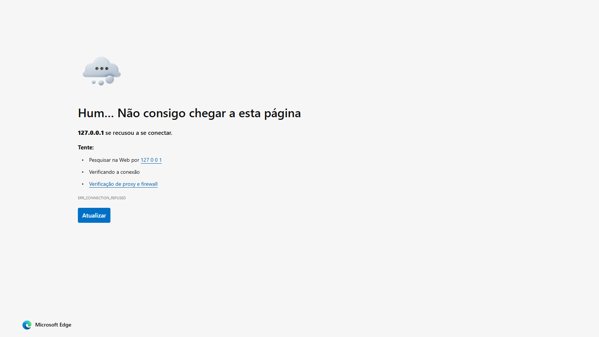
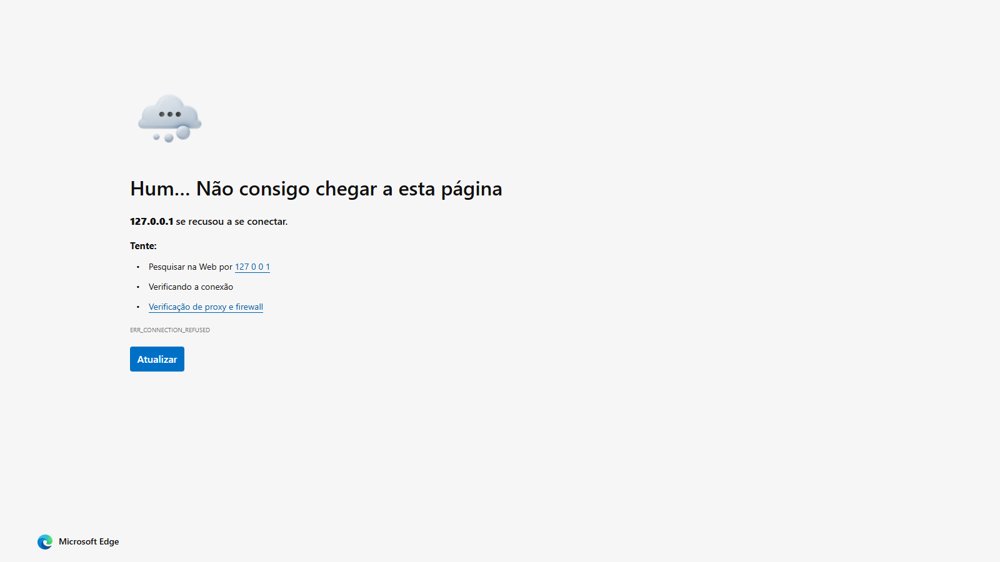
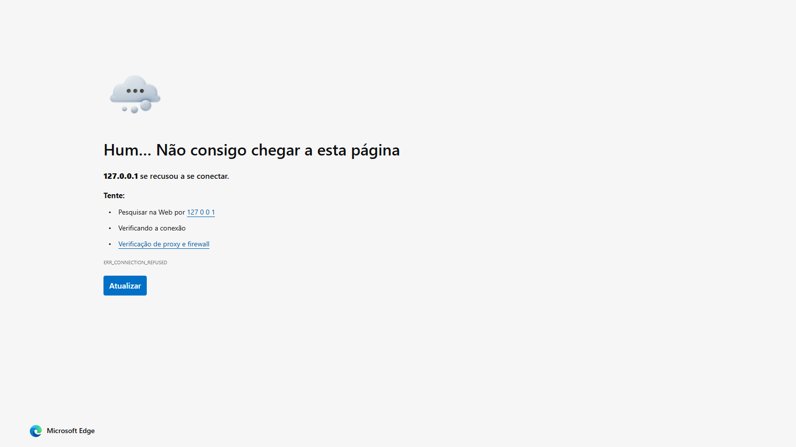

# Web Demos

Vitrine pública de dashboards front-end para cenários de gestão e operação.

## Demos

- `dashboard/index.html` - galeria principal
- `dashboard/dashboard.html` - dashboard executivo
- `dashboard/dashboard-operacional.html` - dashboard operacional

## Estrutura

```text
dashboard/
  css/
    dashboard.css
    index.css
    operational.css
  data/
    executive-data.json
    operational-data.json
  js/
    executive.js
    operational.js
    shared.js
  index.html
  dashboard.html
  dashboard-operacional.html
```

## Recursos implementados

- dados dinâmicos via JSON
- filtros por período (`7d`, `30d`, `90d`)
- seletor de idioma (`PT`/`EN`) nos dashboards
- tema claro/escuro com persistência (`localStorage`)
- estados de UI: loading, vazio e erro
- navegação entre demos com botão de retorno
- semântica e rótulos para acessibilidade básica
- exportação CSV para tabelas de canais e atividades

## Como executar

Pode abrir os arquivos HTML direto no navegador, ou usar um servidor local simples:

```bash
python -m http.server 8010
```

Depois acesse: `http://127.0.0.1:8010/dashboard/`

## Testes (Playwright)

```bash
npm install
npx playwright install
npm run test:e2e
```

## Deploy no GitHub Pages

Deploy automático configurado em `.github/workflows/pages.yml`.

1. No repositório `web`, abra **Settings > Pages**
2. Em **Build and deployment**, selecione **GitHub Actions**
3. Faça push na branch `main`
4. Aguarde o workflow **Deploy dashboard to GitHub Pages**

URL final esperada:

`https://leonardofelps.github.io/web/dashboard/`

## Screenshots




